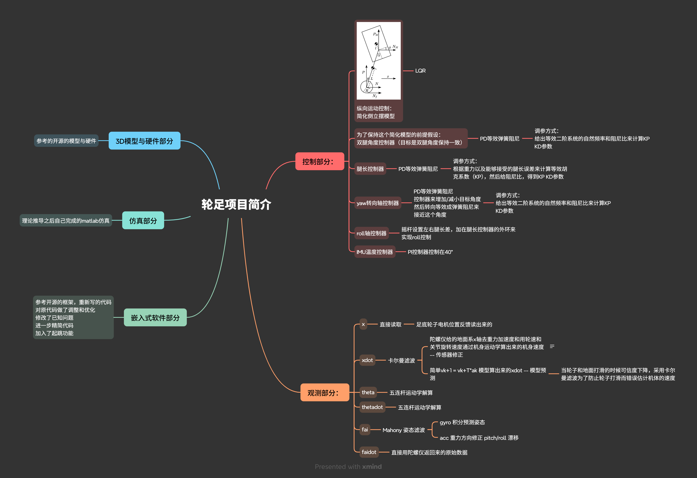

# CV

> 机器人与嵌入式工程实践 · 控制理论与智能机器人方向 
> 项目经历：2024.09—2026.09

## 个人简介

具备一定的机器人与嵌入式工程实践经验，曾独立推进轮足机器人项目，对方案设计、硬件搭建、软件开发、整机调试、故障定位与持续迭代的完整流程具有较为实际的认识。在项目中接触并处理过电机、传感器、通信、实时任务调度及软硬件协同等问题，对查错有经验

重视实际成果，希望参与的工作最终能够落实为可运行的系统、可复现的实验或可验证的阶段性研究成果。

## 专业基础与实践能力

### 机器人与嵌入式系统

- 对机器人项目从设计到落地的工程流程具有实际认识
- 具备 MCU 开发经验，对电机、传感器、通信、实时任务调度及软硬件协同有实践基础
- 设计过单片机核心板、模拟信号发生器和简易示波器等电路，对 PCB 设计及基础模拟电路具有一定实践经验

### 控制理论

- 系统学习过经典控制理论、信号与系统及现代控制理论
- 较为详细地学习和推导过 LQR、线性 MPC、卡尔曼滤波、iLQR 和 DDP 等基于模型的控制与轨迹优化方法
- 接触过强化学习，实际用到的时候能够快速上手

### 数学与物理基础

- 扎实的线性代数、微积分和优化基础
- 课外学习过理论物理，能够分析机器人系统数学模型
- 学习过过泛函分析等进阶数学内容，对数学没有犯难情绪，能够耐心阅读数学推导

### 机器人软件

- 接触过 ROS 1 和 ROS 2，具备基本认识
- 目前尚未在完整项目中使用 ROS 进行工程实践，但具备快速重新上手并投入开发的基础

## 项目经历

### 轮足机器人项目

项目覆盖建模仿真、嵌入式软件开发与整机调试，主要材料如下：

| 项目材料 | 内容说明 |
| --- | --- |
| [轮足项目整体简介](轮足项目整体简介.png) | 项目目标、整体方案与实现概览 |
| [轮足建模与仿真](轮足建模与仿真.png) | 运动学、动力学、控制建模与仿真工作 |
| [轮足嵌入式开发](轮足嵌入式开发.png) | STM32 嵌入式软件、设备驱动与任务设计 |
| [项目经历视频](项目经历.mp4) | 大学时期做过的项目经历 |
| [MATLAB / Simulink 仿真工程](whell_leg_MATLAB_sim/) | 建模、参数分析、控制器设计与仿真文件 |
| [STM32 嵌入式工程](whell_leg_STM32_Project/) | 固件源码、驱动、算法及相关项目资料 |

## 个人规划与期望

目前在本科阶段学习人工智能，并计划之后继续在本校攻读机器人方向硕士。长期目标是做全栈机器人工程师。短期目标是熟悉现代机器人开发的理论与实践工具链

现阶段希望加入一个能够长期投入的科研项目，愿意投入时间承担具体工作，并通过持续迭代做出真正能够验证和展示的成果
